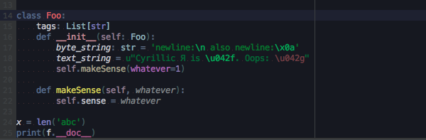
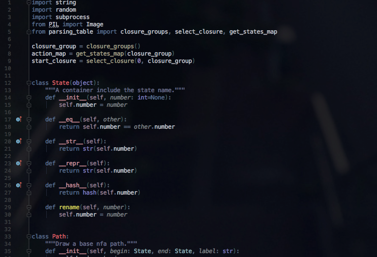
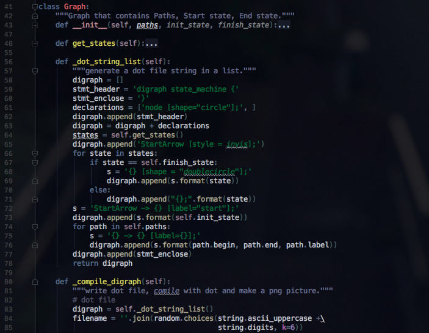

Semantic colorscheme 
=====================

this colorscheme comes from https://github.com/Kuniwak/iceberg.icls as a base.

### General

Generally faces python code by semantic roles, which defines system related tokens blue like, and class related tokens red like, function calls yellow like, constants green like, and variables or ids as default colors. It also mask elements, code pieces like braces, brackets, parenthis, comments, operation signs, that are not so important, or frequently occur in the block, to  lower lightness. This makes easier to find the core logic in the code block.

Installation
------------

Download the latest [`symantic_colors.jar`](https://github.com/dannyvi/pycharm-semantic-colorscheme
).
See [Importing settings from a JAR archive](https://www.jetbrains.com/help/idea/2016.3/exporting-and-importing-settings.html#d2139467e55).

License
-------

MIT License. 

